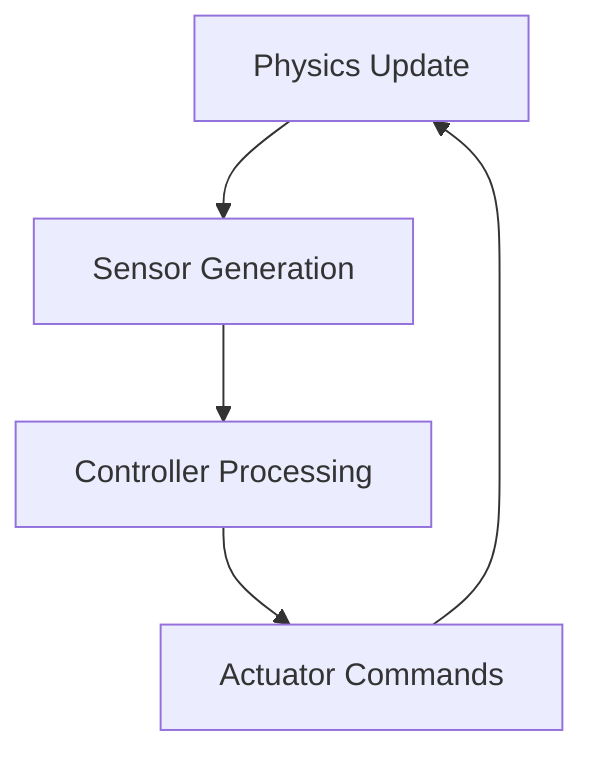

# The Digital Twin (Gazebo & Unity)

## Digital Twins in Robotics

Digital twins represent virtual replicas of physical systems, enabling comprehensive testing, validation, and optimization of robotic systems before deployment. In humanoid robotics, digital twins serve as crucial development environments where complex behaviors, control algorithms, and safety protocols can be tested without risk to expensive hardware or humans.

The concept of digital twins bridges the gap between simulation and reality, allowing engineers to:
- Validate control algorithms in realistic physics environments
- Test edge cases and failure scenarios safely
- Optimize performance parameters before hardware deployment
- Train AI agents in diverse virtual environments

## Gazebo Physics: Gravity, Collisions, and Simulation Loop

Gazebo stands as the premier physics simulator for robotics, offering realistic simulation of gravitational forces, collision dynamics, and environmental interactions. Its robust physics engine supports multiple physics backends including ODE, Bullet, and DART.

### Gravity and Environmental Forces
Gazebo accurately simulates gravitational effects, enabling realistic testing of balance controllers and locomotion algorithms. Parameters like gravity strength, atmospheric conditions, and friction coefficients can be adjusted to simulate different environments - from Earth to Mars or underwater scenarios.

### Collision Detection and Response
The simulator provides sophisticated collision detection algorithms that handle complex geometries and multiple contact points. For humanoid robots, this includes:
- Foot-ground contact for walking stability
- Self-collision avoidance
- Environmental obstacle interactions
- Multi-body dynamics for articulated systems

### Simulation Loop
Gazebo operates on a discrete time step loop that synchronizes physics updates, sensor readings, and controller commands:



This loop ensures realistic timing relationships between perception, decision-making, and actuation, closely mimicking real-world robot behavior.

## Unity for High-Fidelity Visualization and Interaction

Unity provides exceptional rendering capabilities for photorealistic visualization, making it ideal for:
- Training computer vision algorithms with synthetic data
- Creating immersive teleoperation interfaces
- Developing AR/VR interfaces for robot control
- Generating diverse training datasets for AI models

Unity's advantages for robotics include:
- High-quality graphics rendering
- Extensive asset library and scene creation tools
- Cross-platform deployment capabilities
- Advanced lighting and material systems

Unity can interface with ROS 2 through plugins like Unity Robotics Hub, enabling bidirectional communication between the high-fidelity visual environment and the physics simulation.

## Simulating Sensors: LiDAR, Depth Cameras, IMUs

Accurate sensor simulation is crucial for developing robust perception systems. Digital twins must replicate real sensor characteristics including noise, resolution limitations, and failure modes.

### LiDAR Simulation
LiDAR sensors are simulated with realistic beam patterns, range limitations, and noise models:

```xml
<!-- Sample LiDAR sensor configuration -->
<gazebo reference="lidar_link">
  <sensor type="ray" name="lidar_sensor">
    <ray>
      <scan>
        <horizontal>
          <samples>1080</samples>
          <resolution>1</resolution>
          <min_angle>-3.14159</min_angle>
          <max_angle>3.14159</max_angle>
        </horizontal>
      </scan>
      <range>
        <min>0.1</min>
        <max>30.0</max>
        <resolution>0.01</resolution>
      </range>
    </ray>
    <plugin name="lidar_controller" filename="libgazebo_ros_ray_sensor.so">
      <ros>
        <namespace>/lidar</namespace>
        <remapping>~/out:=scan</remapping>
      </ros>
      <output_type>sensor_msgs/LaserScan</output_type>
    </plugin>
  </sensor>
</gazebo>
```

### Depth Camera Simulation
Depth cameras provide 3D perception capabilities with realistic noise models and distortion patterns:

```xml
<gazebo reference="camera_link">
  <sensor type="depth" name="camera_depth">
    <camera>
      <horizontal_fov>1.047</horizontal_fov>
      <image>
        <width>640</width>
        <height>480</height>
        <format>R8G8B8</format>
      </image>
      <clip>
        <near>0.1</near>
        <far>10.0</far>
      </clip>
    </camera>
    <plugin name="camera_controller" filename="libgazebo_ros_openni_kinect.so">
      <always_on>true</always_on>
      <update_rate>30.0</update_rate>
      <camera_name>camera</camera_name>
      <frame_name>camera_depth_optical_frame</frame_name>
    </plugin>
  </sensor>
</gazebo>
```

### IMU Simulation
Inertial Measurement Units provide crucial orientation and acceleration data:

```xml
<gazebo reference="imu_link">
  <sensor name="imu_sensor" type="imu">
    <always_on>true</always_on>
    <update_rate>100</update_rate>
    <plugin name="imu_plugin" filename="libgazebo_ros_imu.so">
      <topicName>imu/data</topicName>
      <serviceName>imu/service</serviceName>
      <gaussianNoise>0.01</gaussianNoise>
      <xyzOffset>0 0 0</xyzOffset>
      <rpyOffset>0 0 0</rpyOffset>
      <frameName>imu_link</frameName>
    </plugin>
  </sensor>
</gazebo>
```

## Simulation Workflow for Humanoid Development

The digital twin workflow for humanoid robot development follows these phases:

### 1. Model Development
- Create accurate URDF models of the robot
- Define materials, masses, and inertial properties
- Configure sensors and actuators

### 2. Environment Setup
- Design diverse simulation environments
- Create challenging terrain and obstacles
- Implement dynamic elements and moving objects

### 3. Controller Testing
- Deploy control algorithms in simulation
- Test stability and performance metrics
- Validate safety protocols and emergency procedures

### 4. Data Collection
- Generate synthetic datasets for AI training
- Collect performance metrics and statistics
- Document successful and failed scenarios

### 5. Transfer to Reality
- Apply domain randomization techniques
- Account for sim-to-real transfer gaps
- Gradually transition validated behaviors to hardware

<figure>
  
  <figcaption>Workflow showing the complete digital twin development process for humanoid robots</figcaption>
</figure>

This systematic approach ensures that humanoid robots can be developed, tested, and refined in safe virtual environments before engaging with the physical world.